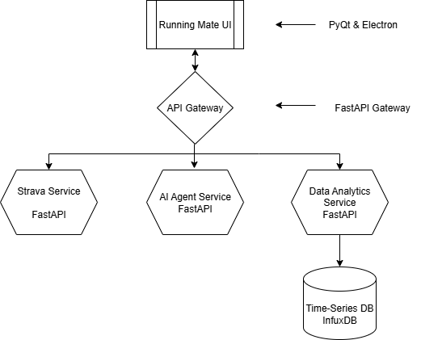

<p align="center">
  
</p>

# 🏃‍♂️🏊 Strava Data Analysis – Microservices-Based Python Application

> **AI-powered running & swimming analysis** with a modern microservices architecture – featuring Docker, Kubernetes, Terraform, Helm, Kafka, and more.

---

## 📜 Overview
This project is a **Python-based microservices architecture** designed to collect, process, and analyze exercise data from **Strava**, providing users with **personalized AI feedback** and **interactive visualizations**.  

Each service is **independently deployable** and **containerized**, making it scalable and maintainable.  
The infrastructure leverages **cloud-native tooling** to ensure reliability and modern development practices.

---

## 🏗 High-Level Architecture
 <!-- Optional: Add diagram image -->

**Key Components:**
- **Frontend UI Service** – Desktop app for data visualization & AI feedback
- **API Gateway** – Routes requests, handles authentication, API versioning
- **Strava Data Collection Service** – Fetches raw workout data from Strava API
- **Data Pipeline & Analytics Service** – Processes and stores workout metrics
- **AI Agent Service** – Generates personalized feedback from processed data
- **Data Visualization Service** – Produces charts and dashboards for the UI
- **Supporting Infrastructure** – Databases, Kafka, monitoring tools

---

## 🔍 Service Breakdown

### 1. **Frontend UI Service**
- **Tech**: PyQt5 / PySide6 (native) or Electron (web-based)
- **Purpose**: Display workout stats, receive AI feedback
- **Communication**: HTTP / gRPC

### 2. **API Gateway**
- **Tech**: FastAPI / NGINX
- **Purpose**: Routing, authentication, API versioning

### 3. **Strava Data Collection Service**
- **Tech**: Python + Strava API
- **Purpose**: Authenticate & fetch workout logs
- **Output**: Publishes events to **Kafka**

### 4. **Data Pipeline & Analytics Service**
- **Tech**: Pandas, NumPy, TimescaleDB/PostgreSQL, Scikit-learn (optional)
- **Purpose**: Process raw data, calculate metrics, predictive analytics

### 5. **AI Agent Service**
- **Tech**: Python + OpenAI API (or similar)
- **Purpose**: Provide personalized AI-powered workout feedback

### 6. **Data Visualization Service**
- **Tech**: Matplotlib, Plotly, Bokeh
- **Purpose**: Serve visual charts/dashboards via API

---

## 🛠 Infrastructure & Tooling
| Tool / Service      | Purpose |
|---------------------|---------|
| **Docker**          | Containerize microservices |
| **Kubernetes**      | Orchestrate and scale services |
| **Helm**            | Manage Kubernetes configurations |
| **Terraform**       | Provision cloud infrastructure |
| **Kafka**           | Event streaming backbone |
| **PostgreSQL + TimescaleDB** | Store time-series metrics |
| **Prometheus + Grafana** | Monitoring and dashboards |
| **MinIO**           | Store large files (GPX/FIT) |
| **Airflow** *(optional)* | ETL scheduling |
| **gRPC** *(optional)* | High-performance service-to-service communication |

---

## 🚀 Getting Started

### 1️⃣ Clone Repository
```bash
git clone https://github.com/your-username/strava-analytics.git
cd strava-analytics
