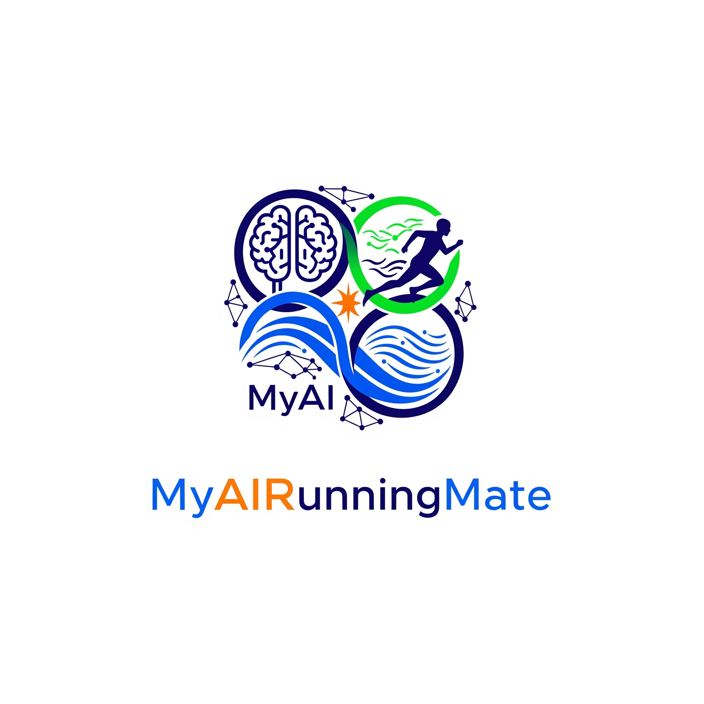

<p align="center">
  
</p>

# 🏃‍♂️🏋️‍♂️ MyAIRunningMate

> **A comprehensive, AI-powered multi-sport training platform that unifies Garmin and Strava data, parses raw telemetry, and delivers tailored athletic insights.**

---

## 📜 Overview
**MyAIRunningMate** is a full-stack application designed to merge fitness data from **Garmin** and **Strava** into a single, cohesive dashboard. By combining high-performance data parsing with advanced generative AI, the platform acts as an intelligent training companion. 

From analyzing raw `.fit` files to generating adaptive, multi-sport training plans using Gemini, MyAIRunningMate handles the heavy lifting of athletic data aggregation so athletes can focus on performance.

---

## ✨ Key Features

* **🏠 Centralized Dashboard & Nexus AI**
    * **Weekly Progress Feed:** Real-time tracking of current weekly volume and progress metrics.
    * **Nexus AI Agent:** A dedicated wrapper agent built on the Gemini API, strictly contextualized to focus on your exercise and biometric data to deliver weekly interpretation and feedback.
    * **PR Records:** Dynamic personal records synced directly from Strava.
    * **Upcoming Events:** High-level countdown and visibility into your next target races.

* **📅 Interactive Training Calendar**
    * Visual representation of historical activities paired with future training plan events.
    * Deep-dive click views for activities showcasing detailed lap splits, Strava social data, and interactive route mapping using **Leaflet**.

* **🧬 Ingestion Lab**
    * Direct drag-and-drop interface for raw Garmin `.fit` files.
    * Automated extraction, descrambling, and synchronization of biometric and GPS telemetry into the data store.

* **📊 Analytics Vault & Weight Tracker**
    * Yearly aggregation of progress, distance, activity counts, and average Training Effects (Aerobic/Anaerobic).
    * Dedicated weight tracking module featuring historical trend graphs to monitor body composition alongside training load.

* **🤖 Nexus AI Mate (Plan Generator)**
    * Custom training wizard capturing user parameters: swimming pool accessibility, athletic goals, experience level, and target timeline.
    * Generates highly tailored, fully customizable multi-sport training plans (Running, Swimming, Walking, Hiking, etc.) powered by **Gemini 2.5 Flash**.

* **📬 Automated Training Delivery (Daily Digests)**
    * **Supabase Cron Job & Edge Functions:** An automated cron schedule triggers a serverless Edge Function daily to scan upcoming calendar states.
    * **Email Notifications:** Fetches the day's scheduled training events (e.g., target running mileage, swimming sets, or rest days) and dispatches a clean morning digest directly to the user's inbox.

---

## 🏗 System Architecture & Tech Stack

The application leverages a decoupled, multi-service architecture designed to enforce a strict engineering principle: **The core system computes facts deterministically, while the AI is utilized for interpretation, personalization, and explanation.**

[ React / Vite Frontend ] 
       │             ▲
       ▼             │
[ C# .NET Core API ] ◄───► [ Supabase (PostgreSQL / Auth) ] ◄─── [ Supabase Cron ]
       │             ▲                      │
       ▼             │                      ▼
[ Python FastAPI Heavy Processor ]   [ Edge Function ] ───► ( Email Delivery )

### 💻 Frontend
* **Core:** React (Vite)
* **Styling:** Tailwind CSS
* **Networking:** Axios
* **Charts & Maps:** Recharts (Data Visualizations), Leaflet (Interactive Route Maps)

### 🛡 Backend API (C# .NET)
Built following **Domain-Driven Design (DDD)** principles to handle business logic, orchestration, authentication validation, and external contract enforcement.
* **Contracts Layer:** Defines request/response DTOs and API specifications.
* **Service Layer / Application Layer:** Manages application orchestrations, external API communications, and use-case execution.
* **Domain Layer:** Encapsulates core fitness logic, enterprise invariants, and business entities.
* **Database Layer:** Interfaces with the persistent data store.

### 🐍 Heavy-Duty Processing & AI API (Python)
A high-performance REST API dedicated to computationally heavy data parsing and LLM integrations.
* **Framework:** FastAPI + Pydantic (Data validation)
* **Telemetry Parsing:** `fitparse` library for decoding binary Garmin `.fit` files.
* **AI Engine:** `google-genai` integration utilizing the **Gemini 2.5 Flash** model for structured training plan generation.

### 🗄 Storage & Auth
* **Supabase:** Handles relational data storage (PostgreSQL), transactional queries, and secure user authentication.

### ⚡ Automation & Edge Serverless
* **Supabase Cron:** Handles time-based scheduling to ensure reliable, periodic execution without maintaining an active background worker thread.
* **Supabase Edge Functions:** TypeScript-based serverless functions that securely execute on the edge to query daily training plan events from PostgreSQL and dispatch automated morning email digests to users.

---

## 🛠 Infrastructure & Local Deployment

The entire ecosystem is containerized for seamless local development and deployment. Each service contains its own optimized `Dockerfile`, orchestrated globally via `docker-compose`.

### Prerequisites
* [Docker Desktop](https://www.docker.com/products/docker-desktop/) installed locally.
* Environment configurations (`.env`) populated for Supabase keys, Gemini API keys, and Strava API credentials.

### Spinning up the Ecosystem
To build and run the frontend, C# backend, and Python processing service simultaneously, execute the following from the root directory:

```bash

docker-compose up --build

```